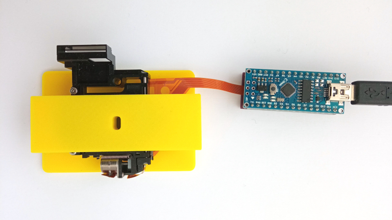
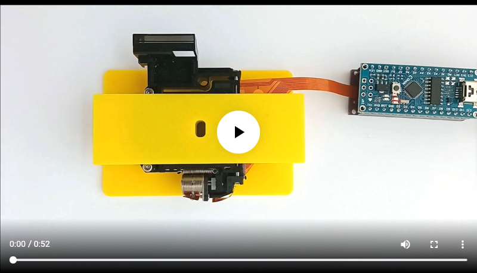
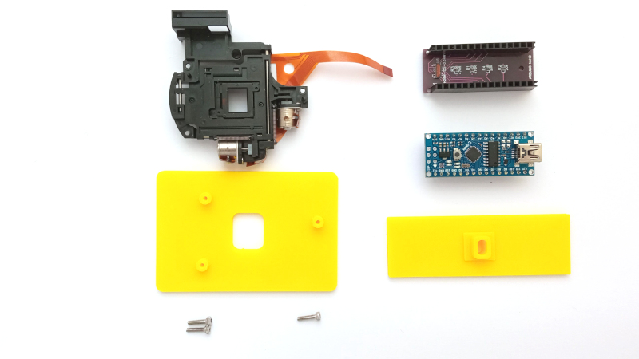
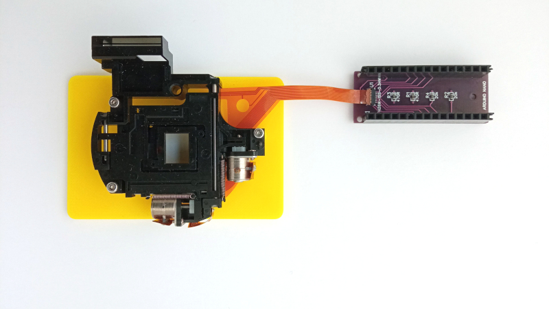
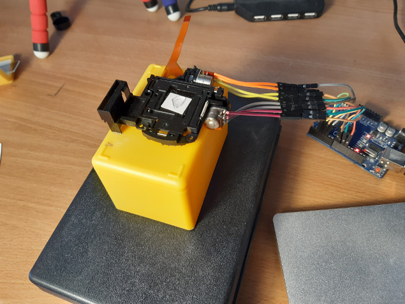
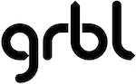

# Microscope XY Stage

[](pictures/assembled.jpg)

This is a small computer-controlled mechanical microscope stage, with a movement of 2.4mm in both x and y, with a resolution of 5 &micro;m. Design goal is low component cost.

[](https://vimeo.com/698148429)

[video](pictures/xy_stage.mp4) of the stage in motion.

[](pictures/disassembled.jpg)

The stage consists of

- mechanical part
- adapter plates
- connector board
- arduino nano controller
- firmware

## mechanical part

[](pictures/mechanical.jpg)

Picture of mechanical part (to the left) and connector board (to the right).
The mechanical part is the [motion compensation part of a digital camera](https://www.aliexpress.com/item/32972295033.html), bought from aliexpress. All signals are on a flat flexible cable.

The mechanical part consists of a small carriage, two stepper motors and two slotted optocouplers, one for x and one for y. The stepper motors have a step size of  10 &micro;m. The stepper motors are run in half-stepping mode, resulting in a resolution of  5 &micro;m.

## adapter plates

The adapter plates give the microscope stage a flat base to sit on, and a flat top to put a microscope slide on.

The [adapter plates](openscad/) are designed in openscad and 3D printed. The size of the carriage is 25mmx75mm, the same as a standard microscope slide. I've snipped a few plastic pieces off from the movement to make everything fit. Holes can be threaded with hand tapping tools, or reamed with a small drill.

## connector board

The [connector board](easyeda/Schematic_xy%20stage%20breakout_2022-04-08.pdf) breaks out the flat cable to the arduino pins. The xy stage contains two optical endstops, one for x and one for y. This is the [schematic](pictures/xystage_endstop.pdf) of one such optical endstop. There are current-limiting resistors for the optocoupler led, and pull-down resistors for the optocoupler output.  The stepper motors are so small you can connect them directly to the microcontroller pins.

The [board project is at easyeda](https://oshwlab.com/koendv/xy-stage-breakout); and I've put up [gerbers at github](easyeda/).

To manufacture a pcb board

- go to the [board project](https://oshwlab.com/koendv/xy-stage-breakout)
- click on "Editor open"
- choose the menu "Fabrication"
- choose "One click order PCB/SMT"

The Hirose flat cable connector can be bought from [aliexpress](https://www.google.com/search?q=%22FH26W-15S-0.3SHW%22+site%3A.aliexpress.com)

## Soldering wires
[](https://forums.raspberrypi.com/viewtopic.php?t=210605&sid=cc13e9c79fb1d1ca8f52a80ca8923534&start=75#p1678566)

If you don't like soldering SMD components, you can also solder small [patch wires](https://www.adafruit.com/product/1446) directly to the stage.

## arduino nano controller

The microcontroller is a 5V 16MHz arduino nano. This processor was chosen because it can drive the stepper motor pins directly, at low cost. The arduino nano plugs in in the connector board.

Two firmware are available for the xy stage: an arduino sketch and the grbl g-code motion controller.

## arduino sketch

The [arduino/ directory](arduino/) contains an arduino project for the xy stage.
To install this firmware in the arduino nano, start up the arduino IDE. Open the file [xystage.ino](arduino/xystage/xystage.ino) in the arduino IDE,
In the arduino IDE, choose "Tools -> Board -> Arduino AVR Boards -> Arduino Nano", compile and upload.

Connect to the arduino serial port with a terminal emulator, and get this prompt:

```
xy stage - w forward s backward a left d right x home
ok
```

Move the stage using the WASD keys: w is forward, s is backward, a is left, d is right. x homes the stage, and if you press shift the stage moves ten times faster.

| key | action |
|---|---|
| w | forward 1 step |
| s | backward 1 step |
| a | left 1 step |
| d | right 1 step |
| W | forward 10 steps |
| S | backward 10 steps |
| A | left 10 steps |
| D | right 10 steps |
| x | home |

If after power-up the led blinks and the serial console prints  ``error`` then homing failed. Check the flat flexible cable connections, and that the carriage can move freely.

## grbl

[](https://github.com/gnea/grbl/wiki)

[grbl](https://github.com/gnea/grbl/wiki) is a g-code motion controller for the arduino nano. grbl allows stage control using G-code commands.

Example: Set the feed rate. Starting at the origin, first move the stage 1 mm in x, then 1 mm in y.

```
> Grbl 1.1h ['$' for help]
< F100
> ok
< G1X1
> ok
< G1Y1
> ok
```

See the [grbl/ directory](grbl/) for grbl firmware for the arduino nano.

Using G-code is interesting if you wish to automate a microscope.

## micro-manager

[micro-manager](https://micro-manager.org/) is open source software for control and automation of microscope hardware. See the [micro-manager/ directory](micro-manager/) for using the xy-stage with micro-manager.

## bill of Materials

The list of materials used to build this project:

|Name|Part|Qty|
|---|---|---|
|R1, R3|470R 0603|2|
|R2, R4|18K 0603|2|
|U1|Hirose FH26W-15S-0.3SHW(60)|1|
||20pin 2.54mm single row female header|2|
||arduino nano 3.0 atmega328|1|
||[small xy stage](https://www.aliexpress.com/item/32972295033.html)|1|
||M2x8 screw|3|
||pcb|1|
||3D printed parts|1|

[](https://ko-fi.com/Q5Q03LPDQ)
