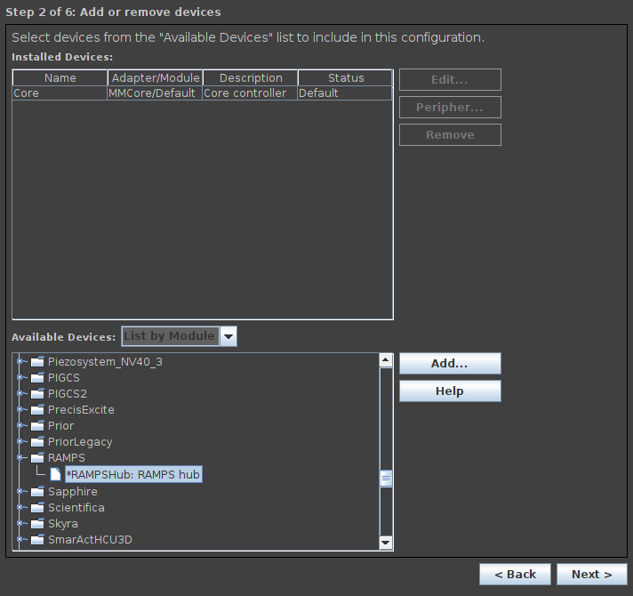
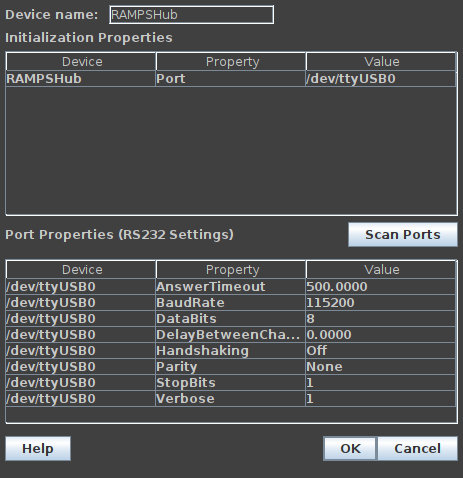
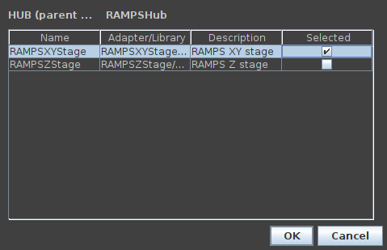

# micro-manager

[micro-manager](https://micro-manager.org/) is open source software for control and automation of microscope hardware. This is a micro-manager driver for a mechanical stage that uses a grbl controller.

Instead of writing a separate driver for grbl, this patches the existing micro-manager RAMPS driver to use grbl g-code.

## compile

Patch micro-manager sources with _micro-manager-grbl.patch_:
```
 $ git clone --recursive https://github.com/micro-manager/micro-manager/
 $ cd micro-manager/mmCoreAndDevices/
 $ wget https://raw.githubusercontent.com/koendv/xy-stage/main/micro-manager/micro-manager-grbl.patch
 $ patch -p1 < micro-manager-grbl.patch
patching file DeviceAdapters/CNCMicroscope/RAMPSStage/RAMPS.cpp
patching file DeviceAdapters/CNCMicroscope/RAMPSStage/RAMPS.h
```

[Compile and install](https://github.com/micro-manager/micro-manager/blob/main/doc/how-to-build.md).

## configure

To configure, choose Devices -> Hardware Configuration Wizard.



Select xy stage serial port.



Select only xy stage, not z stage.



Choose Devices -> Device Property Browser to set xy stage speed and acceleration. The values for RAMPSHub-Acceleration are written to grbl registers 120, 121 and 122. The values for RAMPSHub-Velocity are written to grbl registers 110, 111 and 112.

not truncated
